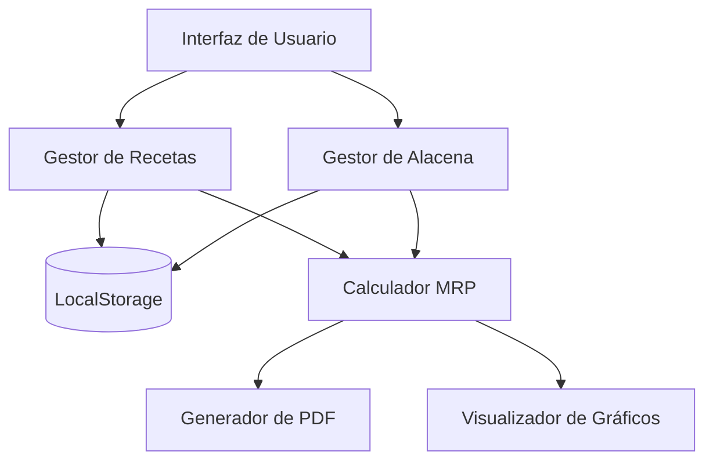
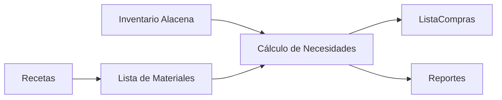

# bom_mrp_recetas


# 📊 Dashboard de Despensa - BOM y MRP
## 📌 Descripción General
Un sistema completo para gestionar recetas, inventario y listas de compras basado en los conceptos de BOM (Bill of Materials) y MRP (Material Requirements Planning).

## 🌟 Características Principales
Gestión de recetas con todos sus ingredientes

Control de alacena e inventario actual

Cálculo automático de necesidades de compra (MRP)

Priorización inteligente de ingredientes

Generación de PDF de la lista de compras

Gráficos interactivos para visualización de datos

Persistencia de datos en el navegador

## 📊 Diagramas Mermaid
Diagrama de Arquitectura del Sistema


Flujo de Datos BOM/MRP


Diagrama de Secuencia - Generación de Lista de Compras
```mermaid
sequenceDiagram
    Usuario->>+Sistema: Solicita lista de compras
    Sistema->>+Recetas: Obtener todas las recetas
    Sistema->>+Alacena: Obtener inventario
    Sistema->>Sistema: Calcular necesidades (MRP)
    Sistema->>Usuario: Mostrar lista de compras
    Usuario->>+Sistema: Solicita PDF
    Sistema->>Sistema: Generar PDF
    Sistema->>Usuario: Descargar PDF
 ```   
## 🛠️ Tecnologías Utilizadas
Frontend: HTML5, CSS3, JavaScript

Bibliotecas: Bootstrap 5, Chart.js, jsPDF

Persistencia: localStorage

Diagramas: Mermaid.js

## 🚀 Cómo Usar
Agregar recetas en la pestaña correspondiente

Registrar ingredientes disponibles en la alacena

Revisar la pestaña de Compras para ver qué necesitas comprar

Generar PDF con la lista optimizada para ir al mercado

## 📂 Estructura del Proyecto
```bash
📁 bom_mrp_recetas/
├── index.html          # Archivo principal con toda la aplicación
├── image/
│   └── logo.png/       # Imagen de Flaticon
└── README.md           # Este archivo
```

